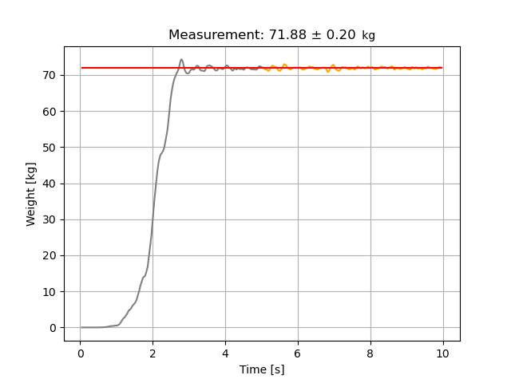

# Tindeq-Progressor-Body-Weight-Scale

This script is based on the example Python script for the Tindeq Progressor API:
https://github.com/blims/Tindeq-Progressor-API

It demonstrates a simple proposal to use the Tindeq Progressor as an effective body weight scale:
- Hang the device on a fixed anchor position above head height with a hold you can hang on.
- Start the script and carefully lift your feet off the ground and hold that position with as little swinging and fluctuation as possible.
- The script will record force measurements for 10 seconds.
- The last 5 seconds are used to compute the body weight as the median measured weight ($\mu$) plus/minus the median absolute deviation ($\sigma$) as a measure of the fluctuations.

This application has two benefits (and might be easily integrated in the Tindeq app in the future):
- Simple and space-saving body weight scale
- Many climbing-related force measurements are reasonably scaled relative to the climbers body weight
(e.g. being able to pull 30kg clearly has different implications for persons that weigh 70kg or 40kg)

Happy playing / training / measuring!

### Example output graph and body weight result

### Simple formulas to estimate body weight based on measurements

$$
\begin{align*}
\mathrm{Measurement} & =\mu\pm\sigma,\\
\mu & =\mathrm{Median}\left[\boldsymbol{w}\left(t\right)\right],\\
\sigma & =\mathrm{MedianAbsoluteDeviation}\left[\boldsymbol{w}\left(t\right)\right],\\
 & =\mathrm{Median}\left[\left|\boldsymbol{w}\left(t\right)-\mathrm{Median}\left[\boldsymbol{w}\left(t\right)\right]\right|\right]
\end{align*}
$$
